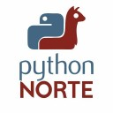

# Usando Virtualenv 
 
Draft sobre *Virtualenv* creado para el sprint del dia 7 de agosto de 2018 organizado por la comunidad **#PythonNorte** este 
documento no pretende ser una guia completa sino mas bien un elemento de referencia para complementar el tema tratado en dicha reunión, 
los conceptos expuestos no son 100% exactos sino  mas bien a de considerarse en muchos casos la interpretación del autor y debe recurrirse a la
documentación oficial ante la menor duda. 

## ¿De que hablamos?
> Un entorno virtual de Python es un ambiente creado con el objetivo de aislar recursos como
librerías y entorno de ejecución, del sistema principal o de otros entornos virtuales. Lo 
anterior significa que en el mismo sistema, maquina o computadora, es posible tener 
instaladas multiples versiones de una misma librería sin crear ningún tipo de conflicto.

En general un entorno virtual nos da la facilidad de crear areas de trabajos aisladas e independientes, donde podremos instalar los paquetes que necesitemos sin miedo a romper dependencias de otros proyectos, el alcance no se limita solo a etapa de desarrollo sino incluye puesta en marcha, 
si eso mismo *¡Podemos usar virtualenv en producción!*  

## Instalación

El uso de *virtualenv* esta tan estendido que se suele incluir como parte de la instalación de las ultimas versiones de python **2.7.x** como **3.x**
de todas maneras explicaremos como instalarlo mediante el gestor de paquetes de python [pip](https://es.wikipedia.org/wiki/Pip_(administrador_de_paquetes)). 

    pip install --upgrade virtualenv 

El comando anterior nos instalara la ultima versión disponible de **virtualenv**, el parametro adicional `--upgrade` permitira que en caso de estar instalado como es de esperar se busque la ultima versión disponible, este metodo de instalación funciona tanto en *Microsoft Windows*, *Mac OS* como *GNU/Linux*.

> **Nota:** Puede que en *GNU/Linux* se requiera ser super usuario para instalar por lo que solo se debera anteponer `sudo`: 

    sudo pip install --upgrade virtualenv 

Alternativamente otra forma de instalación mediante el gestor de paquetes en distribuciónes GNU/Linux basadas en Debian es la siguiente:

    sudo apt-get install python-virtualenv virtualenv

## Creación de entornos virtuales

Un entorno  virtual se crea mediante el comando:

    virtualenv [nombre]

Donde `[nombre]` es el nombre que elegiremos para el mismo. 

A nivel de archivos del sistema, un entorno virtual no es mas que un arbol de directorios, por lo que antes debemos decidir en que directorio los crearemos, por gusto personal *(esto no debe ser tomado como recomendación sino una costumbre del Autor de este articulo)* creo una carpeta llamada **Virtualenv** en mi espacio de trabajo y los suelo nombrar **env2x** si es para python 2.7 o **env3x** si son para python 3.x pero eso es solo un gusto personal no una recomendación, otra alternativa es crearlo dentro del espacio de trabajo y configurar el repositorio para que la ignore.

## Algunas opciones utiles a la hora de crear entornos virtuales

#### --python
Al momento de crear un entorno virtual podemos especificar que version de python queremos que se use mediante la ruta del ejecutable, un ejemplo en 
windows para especificar que el virtualenv trabaje con python 2.7 seria el siguiente:

    virtualenv --python=C:\Python27\python.exe myEnv

Existe un alias `-p` que hace lo mismo
  
    virtualenv -p C:\Python27\python.exe myEnv

#### --clear
Limpia y elimina todos los paquetes instalados en un entorno especifico, uso:

    virtualenv --clear /path/to/my/env 

#### --system-site-packages
Por defecto un entorno virtual se crea en limpio, pero si se desea se puede especificar que se copien e instalen todas las librerias 
instaladas en globalmente.

#### --no-setuptools, --no-pip, --no-wheel
Cualquiera de estos comando son para especificar que no se instale setuptools, pip ó wheel.

## Activando el entorno virtual
La manera de activar un entorno virtual dependera del sistema operativo en el que estemos trabajando

### En Microsoft Windows

      path\to\my\env\Scripts\activate

### En GNU/Linux

      $ source path/to/my/env/bin/activate

### Mac OS

> Pido mil disculpas pero no tengo una MAC.

## Desactivando el entorno virtual
Para desactivar, dejar de usar un entorno virtual basta solo con escribir el siguiente comando:

    $ deactivate

## Clonar un entorno virtual
Virtualenv no ofrece una funcionalidad especifica para esta tarea, pero podemos hacerlo sencillamente usando **pip** para ello activamos el entorno virtual que queremos clonar ejecutamos el siguiente comando:

    $ pip freeze > requeriments.txt

lo que obtendremos aqui es el listado de paquetes con su correspondiente versión instalada, ahora solo tenemos que: 

Desactivar el entorno actual

    $ deactivate

Crear y activar el nuevo (a modo ejemplo llamaremos *clon* supondremos que estamos trabajando en GNU/Linux)

    $ virtualenv clon
    $ source clon/bin/activate

para hacer que pip instale los paquetes necesarios utilizaremos el archivo *requeriments.txt* creado con el comando `pip freeze > requeriments.txt` de la siguiente manera:

    $ pip install -r requeriments.txt

## Eliminar un entorno virtual
Un entorno virtual no es mas que un directorio, la forma de eliminarlo es simplemente borrandolo, por lo que si queremos hacerlo solo
bastara hacer clic con el boton secundario sobre la carpeta contenedora y pinchar en la opción eliminar, alternativamente tambien se puede hacer
via shell mediante el comando `rm`:

    $ rm -fr path/to/my/env/

## Alternativas
Virtualenv no es la unica herramienta para creación de entornos virtuales pero si una de las mas aceptadas aqui un listado de algunas herramientas similares:

* [workingenv](https://pypi.org/project/workingenv.py/) Vendria a ser el predecesor de *virtualenv*
* [virtual-python](http://peak.telecommunity.com/dist/virtual-python.py) Solo crea enlaces simbolicos.
* [zc.buildout](https://pypi.org/project/zc.buildout/) 

## Referencias
* Documentación oficial de Virtualenv [https://virtualenv.pypa.io](https://virtualenv.pypa.io/en/stable/)
* Virtualenv en Pypi [https://pypi.org/project/virtualenv/](https://pypi.org/project/virtualenv/)
* [https://wiki.archlinux.org/index.php/Python/Virtual&lowbar;environment&lowbar;(Español)](https://wiki.archlinux.org/index.php/Python/Virtual_environment_(Espa%C3%B1ol))

## Estado
* 07/08/2018 - Pendiente de Revisión

## Author
* Ricardo D. Quiroga [ricardoquiroga.dev@gmail.com](mailto://ricardoquiroga.dev@gmail.com)
* Comunidad de Python Norte [pythonnorte@gmail.com](mailto://pythonnorte@gmail.com)
